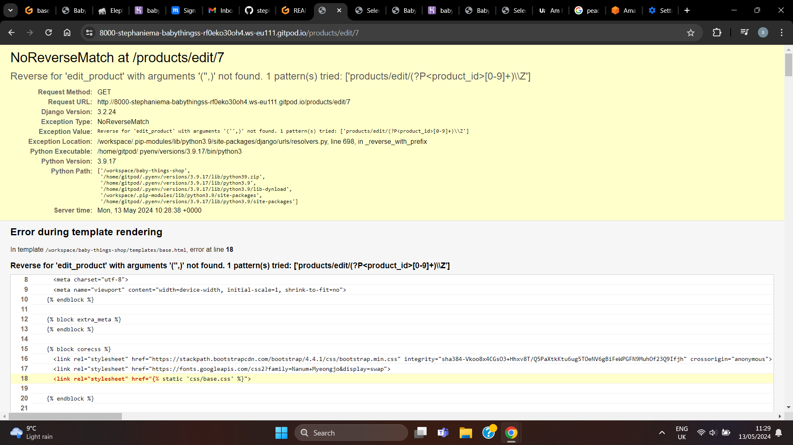
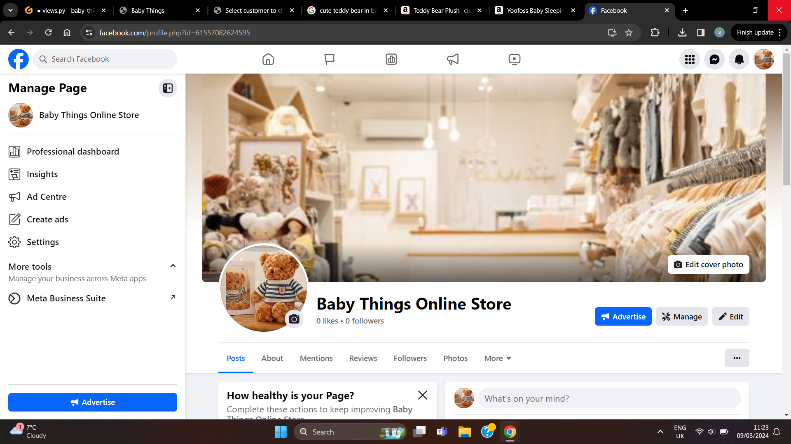
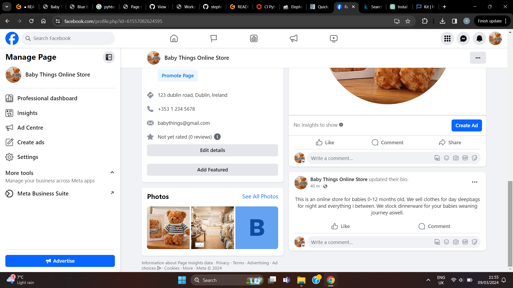
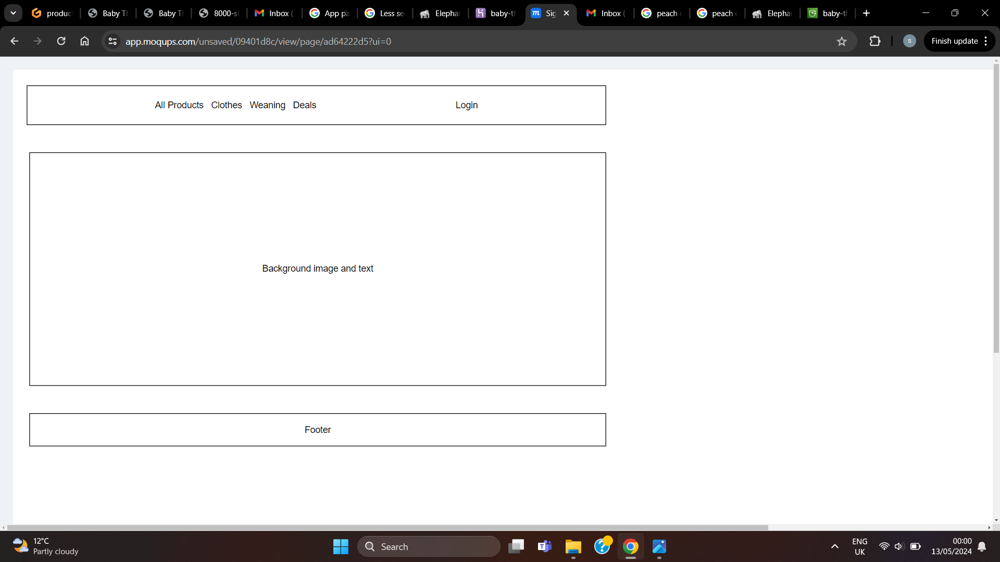
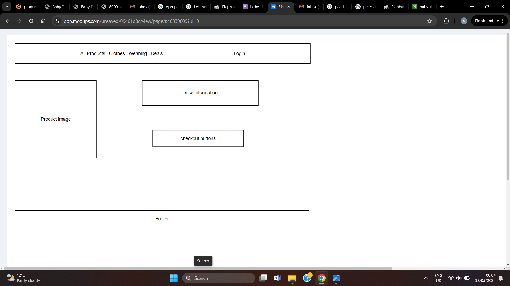
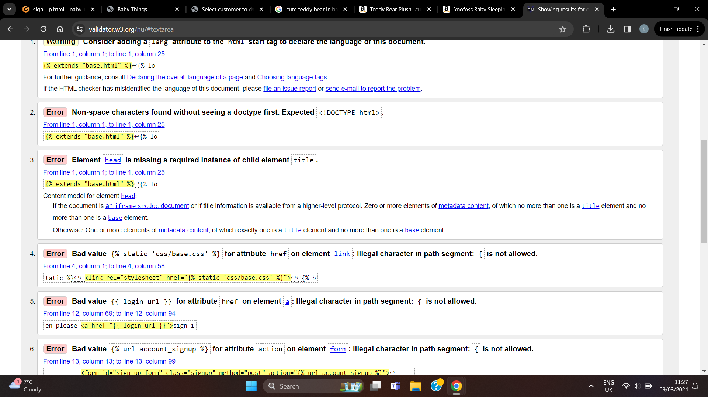
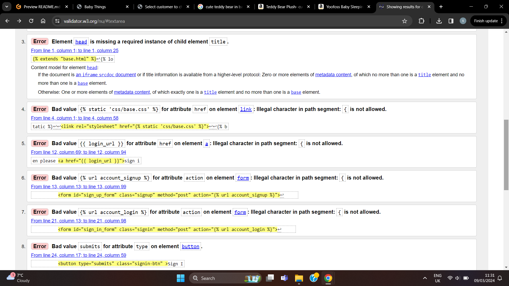

# Introduction

This is my project for E-commerce and it has been creaded in Django! For this project i decided to do an online store that sells items for babies from 0-12. This store sells clothing and tableware for weaning babies onto solid food.The name of my store is called Baby Things!. The intent behind this website is to create a secure and simple online shopping experince selling baby items to parents and caregiver that they will need for theyre babies in the first year of their life and beyond. Including clothes and food supplies. 
 
The data base for my blog is hosted on [Elephantsql](https://www.elephantsql.com/) 
 
The site will be deployed threw [Heroku](https://id.heroku.com/)
 
Images stored on [Cloudinary](https://cloudinary.com)

 ## Features
 * User Authentication
 * Search bar and Drop Down links to products
 * Email Confirmations
 * Order history and delivery detail management
 * Admin Panel for monitoring site and ease of managing products, orders, customer information and newsletter creation

# Prerequisites 

This project is made with [Django 3.2.24](https://docs.djangoproject.com/en/5.0/releases/3.2.24/).   Django is compatible with [Windows 10](https://www.microsoft.com/en-gb/software-download/windows10), [Ubuntu](https://ubuntu.com/) and [MacOS](https://www.apple.com/ie/macos/sonoma/).  
For this project you must use an earlier version of Django Allauth as some files where removed from the newest version that this project relies on, Im using [Django Allauth 0.50.0](https://docs.allauth.org/en/latest/installation/quickstart.html), I have linked the Django Allauth docs for reference.  This project is supported on [Python 3.9.17](https://www.python.org/). I am using [Gitpod](https://www.gitpod.io/) for my ide, you may be able to use new versions of python but i have not tested this.  

Django supports many databases, I had chosen to use Elephantsql when i started this project, however this company has reached its end of life and will be closing down, so you may choose any other databases you prefare and best suits your needs. Refer to [Djangos Documentation on Databases](https://docs.djangoproject.com/en/5.0/ref/databases/). 
Media images are saved on [Cloudinary](https://cloudinary.com/) however feel free to use any image hosting platform you prefare. 
I am using [Stripe](https://stripe.com/) for proccessing payments.  
This project is Hosted on [Heroku](https://www.heroku.com) when deployed. 

# Deployment Instructions

To deploy this project please follow the following instructions.  
1.  Click on this [github link](https://github.com/stephaniemaf/baby-things-shop) and go to my git hub page. Click on the green code button and use the web link to clone the project or click copy. Enter this code in your terminal window:
    * *git clone https://github.com/username/repository-name.git*  
    **Replace with the actual URL of the repository you want to clone.  
    *  *cd repository-name*  
    ** Navigate to the cloned repository

2. When you have done this and the project has loaded into your ide you will need to create and env.py file with your own secret key and database URL and media hosting URL, You will need to import os at the top of the env.py file so be aware of this if it is not automatically there when you create your env.py file. For example your database url will look like this: 
    * **os.environ[DATABASE_URL] = "database_url_here"**, replace database_url_here with your actual database url when you have signed up for it.
3. Next up you will need to install all the libraries and packages contained in the requirements.txt file, First be sure your have python and pip installed, to do this navigate to your terminal and enter the code: 
    * *python --version*  
    * *pip --version* 
4. If you do not have these installed already refer to this [Python link](https://www.python.org/downloads/) from here you can install the newest version of python or any your prefare i have verified that python 3.9.17 will work with this project.
When you have verified you have these installed enter the code:
    * *pip install -r requirements.txt*
5. Once this is done in the terminal window type in:
    * *python3 manage.py runserver*  
    **The first time you run this you will get an Disallowed Host error, in this case just copy the url in the top bar and go back to the settings.py file and under allowed_hosts paste your url there in single quotes. run the project again and you should be on the baby-thing-shop website.
5. To access the admin panel and you will need to create a super user this can be done in the terminal window on your workspace. Firstly type in the code:
    * *python manage.py createsuperuser*.  
    **Follow the prompts and i believe any email is acceptable real or not so *notreal@email.com* ect will work. Next enter a password and then confirm it, note you will not be able to see anything you type in here so just press enter and then enter your password again and press enter. When this is done run your project and navigate to /admin (enter this at the end of the url in the top bar) from here log into the admin panel and have a look around.

## User Data
* Users personal data including Name, Email, Passwords, Home Address ect is stored securly on a database for using with deliveries and access of the site
* Users payment information is processed threw a secure 3rd party payment system and no information is stored on our database
* Order History is stored to allow users to see what they have bought for their own records and to enable us to proccess returns and deliverys.

## Security 
* Djangos Authentication system ensures secure Login and Signup
* CSRF attacks allow a malicious user to execute actions using the credentials of another user without that user’s knowledge or 
  consent. Django has built-in protection against most types of CSRF attacks, providing you have enabled and used it where appropriate
* Admin features are protected by requiring administrator credentials for access. Resigtered users are unable to access this 
  feature
* Sensitive data, such as payment information, is encrypted during transmission using HTTPS
* SQL injection protection, djangos querysets are protected by using query parameterization
* Clickjacking protection is implemented by django via X-frame-Options middleware  
[Django Security Documentation](https://docs.djangoproject.com/en/5.0/topics/security/)

# Website Description
 When you first arrive on my website you will be on the home page. This page has a background image and a button saying shop now that will take you to the Products page. On the home page of the store you will find a " nav-bar " at the top of the page with 4 links. These links are connected to different pages.  
 The first link is All clothing where you can discover items for sale via links of - Price,Catagory and All Products. The second link is called Clothing and this has many options to select for example "boys 0-6, sleepsuits, and All Clothing", thirdly there is a link in the nav bar for Dinner things this is the link for cutlery plates and bowls and bibs. Finally we have the last link in the nav bar and this is the "Special offers" link. This will lead you to deals and new arrivals.
 
 Above the nav bar there is a search bar that you can type in to search the site this link withh accept key words in the description of the items, as Login.You are able to Ssign up as a registered user with a user name via the MyAccount option in the nav bar and selceting Signup. An email confirmation will be sent to your email address you provided and you will need to verify this. If you are viewing the website in development mode the email will be sent to your terminal window and you can navigate to */admin* and verify your email address from the admin panel. Once you are verified and signed in if you click on my account you will see a new heading called My Profile. Here you will see your default delivery information and order history. If you are on the site as an Admin user you will also see a Product Management heading from here you can update the website with new products to sell, but you may also do this from the admin panel dirctly.
 Beside that is the newsletter icon here is a signup form fro subscribing to the newletter. Once you add your email and click subscribe an email will be sent to you confirming your subscription and including a discount code.  
 
Next to the newsletter you have the Shopping Bag. The Shopping Bag will be updated as you add to bag and you can see the price and increment or decrement the quantity of your item as needed."  When you have decided on an item to purchase you need to click on the shopping cart icon and you will be brought to your bag where you can see your Items, Subtotal, Delivery price and Grand Total you will be paying. Once you click Secure Checkout you will be brought to a form where you need to fill in your name and delivery information and your card number, You will also see a small order summary to the right of the screen. For this project you must use Stripes Test [Card Numbers](https://docs.stripe.com/testing#international-cards).  **Please use the card number for United States of America.

 
# Templates

base.html is the main template for the site. Other templates should extend base.html by including the following at the top: 
* **

# Authorisaton

The admin panel allows for CRUD (Create, Read, Update, Delete) operations on products, customers, orders, and newsletters. Admins can manage the website content and user information. The abilty to create another Admin user is available threw the admin panel. However no persons can register fron the frontend of the website as an admin.

# Login and Registration

Django has an Authorisation feature. Users are able to Register and Login to their own profile using an email and password they provided. When signed in they can access their profile and see previous order historys and their default delivery details. They may save their card information for furture purchases and then also Sign up to our newsletter. If a user has forgotten their password they can request a new one and an email will be sent to them with password reset details.

# Database Management

Model for and Order Historys, Delivery details, Products and Customers i used [elephantsql](https://www.elephantsql.com/) as my database for this project. When creating updating or deleting parts of the models you make migrations threw the terminal window and this will update the database on elephantsql. The code to do this is:  
* *python3 manage.py makemirgrations*  
* *python3 manage.py mirgrate*

# CRUD

By logging into the admin panel The super user has the ability to preform full crud functionality my creating newletters, new users, adding products, deleting them, updating usernames and passwords to name a few.

# Images
My images are hosted on [Cloudinary](https://cloudinary.com/)

# Testing

I will be manually testing my Baby Things Store for this Project!

## Home Page
 ### Navbar:   
 I tested each navigation button first by hoovering my mouse over it to see would my hoover function correctly work which i found it did! I then clicked each navigation button to be sure the links i created for the button would trigger a drop down menu.  
 I clicked on All Things. This immediatly threw an error at me. If i was logged out of the admin panel then i was unable to access the store entirely. The error was showing the pagenav.html as causing the error. I went threw the code and noticed it was a spelling error at the top pagenav header html page for the accounts.signup link, once i corrected this there was no issues for signing in and out of the store either logged in or out from the admin panel. I went back to the home page and tried the All Things link again This dropped a menu down containing all expected options for product pages.  
 I clicked on Clothing Things Things. This dropped a menu down containing all expected options for product pages.  
 I clicked on Dinner Things. This dropped a menu down containing all expected options for product pages.  
 I clicked on Specials Offers. This dropped a menu down containing all expected options for product pages.  
 I clicked on My Account. This dropped a menu down containing all expected options.  
 I clicked on the Shopping bag. This brought me to a knew page with the options to go back or continue to checkout. As i had no items in my bag to view thats all that was on the page and what i expected to see.  
 I clicked on the Search bar. I wanted to be able to type in this bar and have it find the product im looking for via product name or part there of, or via item heading. it did work and i was brought to the item page i was searching for.  

 ### Middle Container:
 The container has a background image with text overlay. This is centered and stretched to fit the whole screen but have padding at the edges.
I clicked on the shop now button contained on this page and under the text informing customers of New Arrivals. This brought me to a new page with all the lasted items added to the store contained in it. This test passed like i expected.

### The Footer:
Expectation = I expect the footer to have the words Made by stephanie and links to facebook and instagram. I want these links to lead to the home page of their respective sites.
Result = I clicked on each link and am brought to the front page of their respective sites.

### Shopping Bag:
Expectation: I expected this to bring me into a page with the content of the shopping bag. sign up form i clicked  theon the bag and was shown an attribute error saying that reuslt was as intended and i was indeed brought to the content i was expecting to see. 

## Product Testing

### View Product:
Expectation: I will click on a Sleepbags in the Clothing things drop down menu to test this feature. I expected to be brought to the Sleeping bag item page.  
I was brought To the oage with the image i had chosen to represent my sleepbags
Fix: No fix needed as i was indeed brought to the correct page. I was shown the product image of a sleep bag and i had the option to add it to my cart or keep shopping.

### Add Product:
Expectation: I will be logged in as admin and i will select the My Account option on the nav bar. I will be shown a menu item called Product management. Here a form will be present and i will be able to fill in the fields with my new image. To test this i chose to ass a silicone bowl to my site. I filled in all the required fields and clicked on the add button. To text if this worked i clicked on the search bar above and typed the word Silicone. This then brought me to a product page with the item image of a silicone bowl with the clearnce tag i chose to save it under and it had a price that i chose aswell.
Fix: This test was successful

### Edit Product:
Expectation: I will select the newly added silicone bowl and i will edit the price to 1.99
Fix:

### Delete Product:
Expectation: I will again use the silicone bowl and i will click on the delete button i created and i expect the product to be deleted from my site.
Fix:

## Reviews:
on my site you are able to leave reviews under reviews there are two buttons edit and delete.
Expectation: I expect to log in as a user and click on a product, at the bottom of the page there will be an option to see reviews and beside it and option to leave one. I go to the body box and type ny review i expect a message to pop up say your review is awaiting approval.

Fix: currently no message pops up and i am yet to enable a fix for it.

### Edit review button:
Expectation: I click on edit buttom and am brought to a page where i see the review and can edit in a box and click an update buttom 
Fix: This has worked and my review has been updated and i was redirected back to my review

### Delete review button:
Expectation: I click on delete button and am brought to a page where i see the review. I click a delete button after reading a warning+

Fix: This has worked and my review has been deleted and i was redirected back to the review/product page

## Checkout:
I used the neutral weaning set for this test. I went into the product and clicked add to bag and was brought to my shopping bag. It displayed the product i was buying the subtotal the quantity of the product and above that it shows the delivery cost and the grand total. I then click on secure checkout and am brought to the order page. Here i have a prefilled order form and this is because i already ordered and selected the box for saving my information. I move on and enter my credit card informatin and hit enter. Then my order confirmation is shown and it says that an email has been sent witht the details .

Bugs: There is a bug here and its Emails. While testing on development an email will be sent to the console which is fine however emails will not send to a real email addred while running on heroku i followed the tutorial for the boutiqe ado and used gmail for sending my emails and it will not send for me. In the future i would try differnt smpt providers i just did run out of time on this project to implement that feature.

## Admin Edit/Delete product from the product page

I added edit and delete buttons on the product for super users only. I clicked on edit for this test and was met with this error:

To fix this error i went back to the edit_product.html and noticed a spelling error in the url sp i fixed that and i am able to edit and delete products as admin.  
## Facebook business page  

[Facbook](https://www.facebook.com/profile.php?id=61557082624595)

## Moqups  

# Validator Testing

## Tested on [Validator](https://pep8ci.herokuapp.com/)
Code passed through validator with no issues

# Bugs
Bug not sending emails upon registration has been fixed - 07/2024

No approval message for reviews being left as a pop up, but to let the user know that there needs to be approval i have left a message in a p tag saying the review will need to be approved 

I have no email sign up form as of right now i have made the customer model so that i could have just a button users could click a button and they would be automatically subscribed with the information i saved from when they made an order i hope to implement this very soon 

# Credits 
I took ideas for this project from the code institute walkthrough project Ado. 

# Important links
Link to my [GitHub Repository](https://github.com/stephaniemaf/baby-things-shop
) 

Hosted on [Heroku](https://id.heroku.com/login)